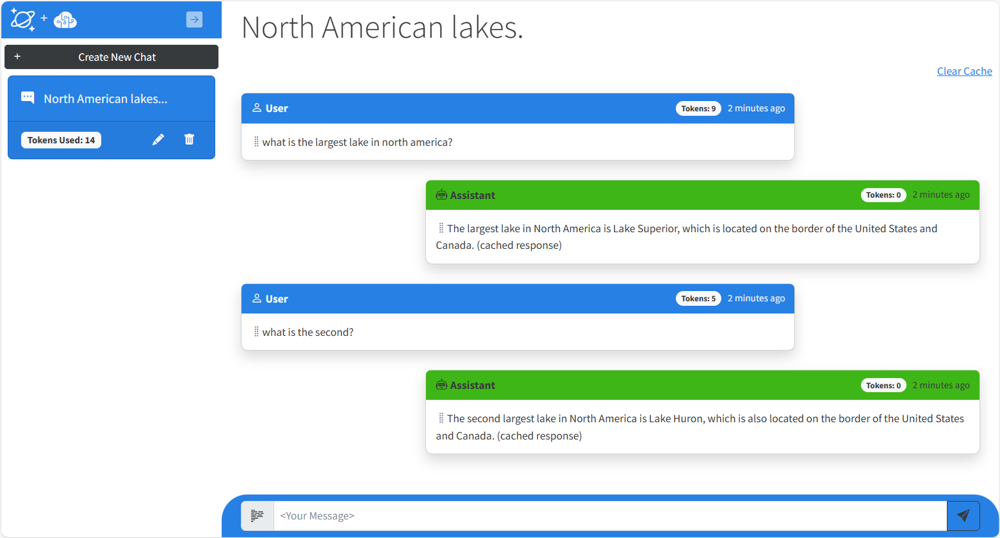

# Build a Copilot app using Azure Cosmos DB & Azure OpenAI Service

This Hands on Lab shows how to build a Generative-AI application using Azure Cosmos DB using its new vector search capabilities and Azure OpenAI Service and Semantic Kernel. The lab provides practical guidance on many concepts you will need to design and build these types of applications including how to: generate embeddings on user input, generating responses from an LLM, managing chat history and token consumption for conversational context, building a semantic cache to enhance performance, and an introduction to using Semantic Kernel which can be used to build complex Generative-AI agents and scenarios. The information in this sample will give you a solid foundation for to create your own AI copilot that you can take and extend toward many use cases.



## Exercises

This lab will walk users through the following exercises:

- Setting up a local environment for completing exercises.
- Connect the application to Azure Cosmos DB and Azure OpenAI Service.
- Send user prompts to a Chat GPT model in Azure OpenAI Service and store and display the responses.
- Implement and test a chat history feature to allow for more natural conversational interactions.
- Implement and test a semantic cache for improved performance.
- Connect to and implement Semantic Kernel SDK as a starting point for building more elaborate Generative AI solutions.

## Getting Started

### Prerequisites

- Azure Subscription
- Subscription access to Azure OpenAI service. Start here to [Request Access to Azure OpenAI Service](https://aka.ms/oaiapply)
- Visual Studio, VS Code, GitHub Codespaces or another editor to edit or view the source for this sample.
- Azure Cosmos DB for NoSQL Vector Search Preview enrollment

This lab utilizes a preview feature, **Vector search for Azure Cosmos DB for NoSQL** which requires preview feature registration. Follow the below steps to register. You must be enrolled before you can deploy this solution:
 
1. Navigate to your Azure Cosmos DB for NoSQL resource page.
1. Select the "Features" pane under the "Settings" menu item.
1. Select for “Vector Search in Azure Cosmos DB for NoSQL”.
1. Read the description to confirm you want to enroll in the preview.
1. Select "Enable" to enroll in the preview.

### Service Deployment

1. Click one of the ***Deploy to Azure*** buttons belows and follow the prompts in Azure Portal to deploy this solution. There is one that deploys a new Azure OpenAI account and a second that allows you to use an existing Azure OpenAI account.

The provided ARM templates will provision the following resources:

1. **Azure Cosmos DB** Serverless account with database and container with a vector embedding policy on the container and vector indexes defined. This can optionally be configured to run on the Cosmos DB free tier if available for your subscription.
1. **Azure App service** configured for CI/CD to your forked GitHub repository. This service can also be configured to run on App Service free tier.
1. **Azure OpenAI Service** You must also specify a name for the deployment of the "gpt" and "embedding" models used by this application.

**Note:** You must have access to Azure Open AI service from your subscription before attempting to deploy this application.

All connection information for Azure Cosmos DB and Azure Open AI is zero-touch and injected as environment variables in the Azure App Service instance at deployment time.

[](https://portal.azure.com/#create/Microsoft.Template/uri/https%3A%2F%2Fraw.githubusercontent.com%2FAzure-Samples%2Fcosmosdb-chatgpt%2Fmain%2Fazuredeploy.json)

**Note:** If you already have an Azure OpenAI account deployed and wish to use it with this application, use this template instead. You will be prompted to provide the name of the Azure OpenAI account, a key, and the name of the GPT 3.5 Turbo model used for completions.
[](https://portal.azure.com/#create/Microsoft.Template/uri/https%3A%2F%2Fraw.githubusercontent.com%2FAzure-Samples%2Fcosmosdb-chatgpt%2Fmain%2Fazuredeploy-no-aoai.json)


### Configuring a lab environment

Feel free to run this lab in GitHub Codespaces or locally in Visual Studio Code in a DevContainer. Then continue with the steps below.

|GitHub Codespaces|Visual Studio Code|
|---|---|
|[](https://codespaces.new/Azure-Samples/cosmosdb-chatgpt/tree/lab-start)|[](https://vscode.dev/redirect?url=vscode://ms-vscode-remote.remote-containers/cloneInVolume?url=https://github.com/azure-samples/cosmosdb-chatpgpt)|


This GitHub repository needs to be cloned to your local machine. The lab manual include details on how to configure to connect with the services deployed in Azure. Only Cosmos DB and Azure OpenAI Service require connection information to run locally.

To run locally, copy the contents of the **appsettings.json** file in the /src folder of the project into a new **appsettings.Development.json** file in the same folder, then copy the Cosmos DB and Azure OpenAI endpoint and key values from the environment variables in Azure App Service into.

You will need to add the values for Azure Cosmos DB and Azure OpenAI Service. Here is an example of the appsettings.json file you will need to update.

**Note:** If you deploy using an existing Azure OpenAI account you will need to update the Completion and Embedding model names to match those in your existing account.

```json
{
  "DetailedErrors": true,
  "Logging": {
    "LogLevel": {
      "Default": "Information",
      "Microsoft.AspNetCore": "Warning"
    }
  },
  "AllowedHosts": "*",
  "CosmosDb": {
    "Endpoint": "your-azure-cosmos-endpoint",
    "Key": "your-azure-cosmos-key",
    "Database": "ChatDatabase",
    "ChatContainer": "ChatContainer",
    "CacheContainer":  "CacheContainer"
  },
  "OpenAi": {
    "Endpoint": "your-azure-openai-endpoint",
    "Key": "your-azure-openai-key",
    "CompletionDeploymentName": "completions",
    "EmbeddingDeploymentName": "embeddings"
  },
  "Chat": {
    "MaxConversationTokens": "100",
    "CacheSimilarityScore": "0.99"
  }
}
```

### Running the lab

To get started navigate to the [Lab Manual](lab-guide.md) and begin!


## Clean up

To remove all the resources used by this sample, you must first manually delete the deployed models within the Azure AI service (if you originally provisioned it using this sample). You can then delete the resource group for your deployment. This will delete all remaining resources.

## Resources

- [Azure Cosmos DB + Azure OpenAI ChatGPT Blog Post Announcement](https://devblogs.microsoft.com/cosmosdb/chatgpt-azure-cosmos-db/)
- [Azure OpenAI Service documentation](https://learn.microsoft.com/azure/cognitive-services/openai/)
- [Semantic Kernel documentation](https://learn.microsoft.com/semantic-kernel/overview/)
