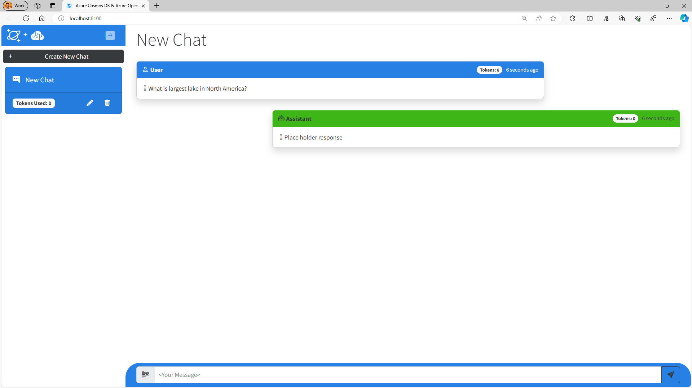
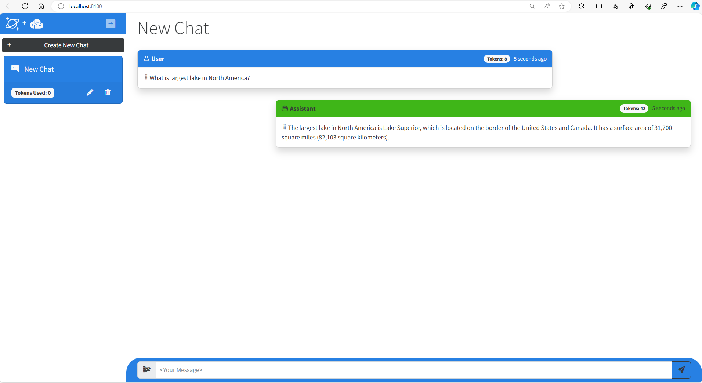
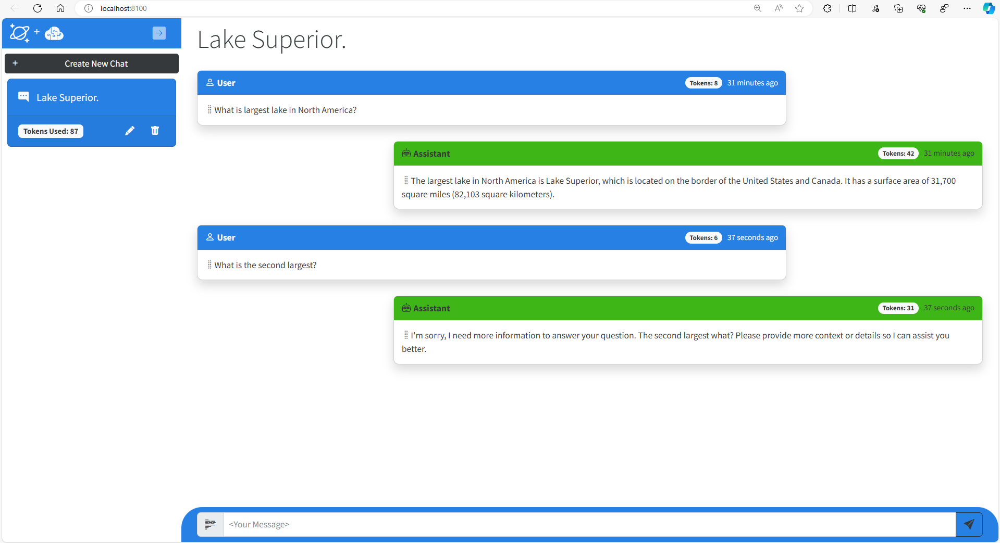
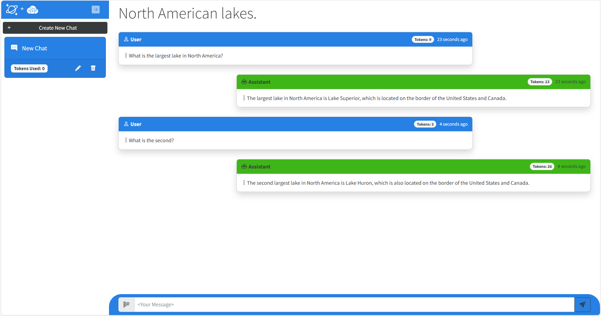
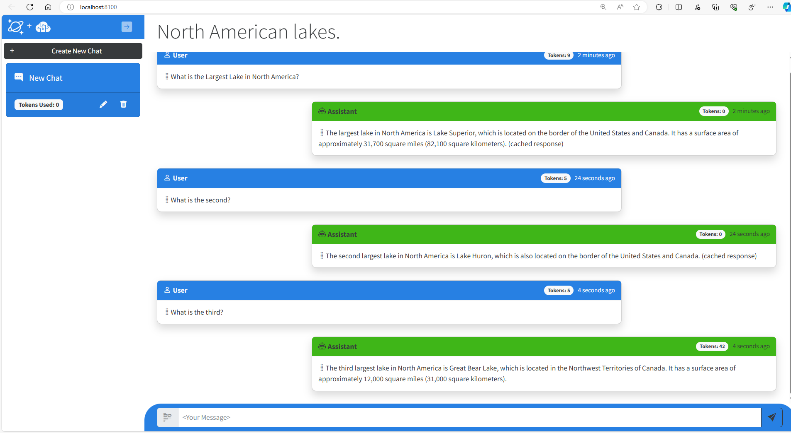

# Integrate Azure OpenAI Service and Azure Cosmos DB for copilot apps

In this hands-on lab, we will show you how to design and build an application using Azure Cosmos DB using its new vector search capabilities and Azure OpenAI service by creating a Generative AI chat experience. This hands-on lab will provide practical insights into generating embeddings on user input, generating responses from an LLM, managing chat history for conversational context, building a semantic cache to enhance performance, and an introduction to using Semantic Kernel which can be used to build more complex scenarios. The skills in this lab will give you a solid foundation for to create your own AI copilot.

## What are we doing?

This lab guides you through the steps to implement Generative AI capabilities for a ASP.NET Core Blazor application with Azure Cosmos DB for NoSQL and Azure OpenAI service integration. These are the main tasks you will accomplish in this lab.

1. Connect the application to Azure Cosmos DB and Azure OpenAI Service. 
1. Send user prompts to a Chat GPT model in Azure OpenAI Service and store and display the responses.
1. Implement and test a chat history feature to allow for more natural conversational interactions. 
1. Implement and test a semantic cache for improved performance.
1. Connect to and implement Semantic Kernel SDK as a starting point for building more elaborate Generative AI solutions.


# Prepare

You're updating an existing .NET solution that has an ASP.NET Blazor application as its sole project. This project includes service classes for Azure Cosmos DB and Azure OpenAI Service that need to connect to the deployed services in Azure.

Before moving to the next step, ensure you have completed the **Service Deployment** as well as the **Configuring a lab environment** in the [README File](README.md).

Once this is complete, you may begin the lab.


# Exercise: Setup and run the starter web application

The first step of this project is to ensure the existing starter application builds and runs successfully.

There are a few requirements in this exercise:

- Successfully build the application.
- Run the application using the **Hot Reload** feature of .NET

### Configure dev environment

The [Dev Containers extension](https://marketplace.visualstudio.com/items?itemName=ms-vscode-remote.remote-containers) for Visual Studio Code requires [Docker](https://docs.docker.com/) to be installed on your local machine. The extension hosts the development container locally using the Docker host with the correct developer tools and dependencies preinstalled to complete this training module.

This lab assumes the use of Visual Studio Code. However, you may use any IDE you wish.


1. Open a local **Terminal or Shell**. Change the current working directory where you cloned this application, for example, **C:\Users\Mark\Repos\cosmosdb-chatgpt\src**.

    ```bash
    cd C:\Users\Mark\Repos\cosmosdb-chatgpt\src
    ```

1. Use the **devcontainer CLI** to open the current folder as a development container.

    ```bash
    devcontainer open
    ```

1. Within **Visual Studio Code**, open a new terminal.

1. Validate that .NET 8 is installed in your environment:

    ```bash
    dotnet --list-sdks
    ```

    The command should output .NET version **8.0.0** or higher.

**NOTE:** The remaining exercises in this hands-on lab take place in the context of this development container.


## Build and run the application for the first time

Now it's time to make sure the application works as expected. In this step, build the application to verify that there's no issues before we get started.

1. Open a new terminal.

1. Build the application using [dotnet build](https://learn.microsoft.com/dotnet/core/tools/dotnet-build).

    ```bash
    dotnet build
    ```

1. The Terminal should display a successful build.

1. At this point, your app has enough information to also run but not enough to generate a real response from an LLM. Let's run the application to make sure your code doesn't have any omissions or errors.

1. Return to the terminal in VS Code.

1. Run the .NET project.

    ```bash
    dotnet run
    ```

1. Visual Studio Code launches an in-tool simple browser with the web application running. In the web application, create a new chat session and ask the AI assistant this question, `What is the largest lake in North America?`. The AI assistant will respond with text, **"Place holder response"** and a token value of zero.



1. Close the terminal. (Click the garbage can icon.)


# Exercise: Implement the Azure OpenAI Service

Let's implement the Azure Open AI Service so we can generate real responses from an LLM. This service contains three methods but we will only focus on the one that generates the main responses in our chat. The other generates a summary of the conversation displayed in the UI and another generates embeddings that we will use in a later exercise.

## Generating completions from Azure OpenAI Service

We will implement the function that calls Azure OpenAI Service that generates a chat completion from an LLM for a given user prompt or question from a user. The function will return the text generated as well as the number of tokens to generate a response.

1. Open the **Services/OpenAiService.cs** file.

1. Within the **GetChatCompletionAsync()** method, comment out the existing placeholder code as seen below.

    ```csharp
    public async Task<(string completion, int tokens)> GetChatCompletionAsync(string sessionId, List<Message> conversation)
    {
        //await Task.Delay(0);
        //string completion = "Place holder response";
        //int tokens = 0;
    }
    ```
1. Create a string variable named **userMessage** that will do a string join on the **conversation** parameter. We will get to why this is a *List* object in a future exercise. At this point, it only contains a single user prompt.

    ```csharp
    string userMessage = string.Join(Environment.NewLine, conversation.Select(m => m.Prompt + " " + m.Completion));
    ```

1. Create a new variable named **ChatCompletionsOptions** object named **options**. Then add the code as seen below.

    ```csharp
    ChatCompletionsOptions options = new()
    {
        DeploymentName = _completionDeploymentName,
        Messages = {
            new ChatRequestSystemMessage(_systemPrompt),
            new ChatRequestUserMessage(userMessage)
        },
        User = sessionId,
        MaxTokens = 1000,
        Temperature = 0.2f,
        NucleusSamplingFactor = 0.7f
    };
    ```

1. Next we will call the Azure OpenAI service's **GetChatCompletionsAsync()** function with our local client instance and pass the options variable created above and get the result in a Response object. Add the code as seen below.

    ```csharp
    Response<ChatCompletions> completionsResponse = await _client.GetChatCompletionsAsync(options);
    ```

1. Next, we need to extract the completion text and tokens from the response object. Add the code as seen below.

    ```csharp
    ChatCompletions completions = completionsResponse.Value;
    string completion = completions.Choices[0].Message.Content;
    int tokens = completions.Usage.CompletionTokens;
    ```

1. Finally, ensure to return a tuple of the completion text and tokens for the function.

    ```csharp
    return (completion, tokens);
    ```

1. Once you have finished inserting all the code above, you can deleted the commented lines at the top of the function. 

1. Save the **Services/OpenAiService.cs** file.

## Check your work

At this point, your application has what must be implemented to test sample user prompts and completions generated by Azure OpenAI Service.

1. Open a new terminal and start the application using **dotnet run**.

    ```bash
    dotnet run
    ```

1. Visual Studio Code will launch the in-tool browser again with the web application running. 

1. In the web application, create a new chat session and ask the AI assistant this question, `What is the largest lake in North America?`. The AI assistant now responds with a completion created by Azure OpenAI Service saying that `Lake Superior` is the largest lake, with some additional information. You should also notice that the *token* UI fields are now populated with actual token usage for the completion.

     

1. Close the terminal. (Click the garbage can)

<details>
    <summary>Is your application not working or throwing exceptions? Click here to compare your code against this example.</summary>

</br>
 
Review the **GetChatCompletionAsync()** method of the **OpenAiService.cs** code file to make sure that your code matches this sample.
 
    ```csharp
    public async Task<(string completion, int tokens)> GetChatCompletionAsync(string sessionId, List<Message> conversation)
    {
        string userMessage = string.Join(Environment.NewLine, conversation.Select(m => m.Prompt + " " + m.Completion));
        ChatCompletionsOptions options = new()
        {
            Messages =
            DeploymentName = _completionDeploymentName,
            {
                new ChatRequestSystemMessage(_systemPrompt),      
                new ChatRequestUserMessage(userMessage)
            },
            User = sessionId,
            MaxTokens = 4000,
            Temperature = 0.2f,
            NucleusSamplingFactor = 0.7f
        };
        Response<ChatCompletions> completionsResponse = await _client.GetChatCompletionsAsync(options);
        ChatCompletions completions = completionsResponse.Value;
        string completion = completions.Choices[0].Message.Content;
        int tokens = completions.Usage.CompletionTokens;
        return (completion, tokens);
    }
    ```
</details>

# Exercise: Implement Chat History (Context Window)

We have the basics for our Generative AI application now in place. Next let's test further and explore how well it responds to natural language interactions.

## Test contextual follow up questions

Humans interact with each other through conversations that have some *context* of what is being discussed. OpenAI's ChatGPT can also interact this way with humans. However, this capability is not native to an LLM itself. It must be implemented. Let's explore what happens when we test contextual follow up questions with our LLM where we ask follow up questions that imply an existing context like you would have in a conversation with another person.

1. Open a new terminal and start the application using **dotnet run**.

    ```bash
    dotnet run
    ```

1. In the web application, create a new chat session and ask the AI assistant the same question again, `What is the largest lake in North America?`. And wait for the response, "Lake Superior" with some additional information. 

1. Ask this follow up question. `What is the second largest?`. The response generated should look like the one below and will either have nothing to do with your first question, or the LLM may respond it doesn't understand your question.

     

What you are observing is LLM's are stateless. They do not by themselves maintain any conversation history and is missing the context necessary for the LLM to respond appropriately to your second question.

In this exercise we will show how to implement chat history, often called a **Context Window** for a Generative AI application. We will also explain the concept of tokens for an LLM and why these are important to consider when implementing a context window.

But before we write the code, we need to first understand the concept of tokens.

## Tokens in Large Language Models

Large language models require chat history to generate contextually relevant results. But there is a limit how much text you can send. Large language models have limits on how much text they can process in a request and output in a response. These limits are not expressed as words, but as **tokens**. Tokens represent words or part of a word. On average 4 characters is one token. Tokens are essentially the compute currency for large language model. Because of this limit on tokens, it is therefore necessary to limit them. This can be a bit tricky in certain scenarios. You will need to ensure enough context for the LLM to generate a correct response, while avoiding negative results of consuming too many tokens which can include incomplete results or unexpected behavior.

So to limit the maximum amount of chat history (and text) we send to our LLM, we will count the tokens for each user prompt and completion up to the amount specified in the **_maxConversationTokens** variable in the function we will now implement.

## Building a context window using tokens

For this exercise we will implement the **GetChatSessionContextWindow()** function in the **Services/ChatService.cs** class and modify another function, **GetChatCompletionAsync()** that will call the first function to build our chat history.

1. Within the **ChatService.cs** class locate the **GetChatSessionContextWindow()** method. The **allMessages** variable in this function will fetch the entire chat history for a session. The **contextWindow** is what we will use to construct a subset of those messages to send to the LLM to provide context.

    ```csharp
        private async Task<List<Message>> GetChatSessionContextWindow(string sessionId)
        {
           List<Message> allMessages = await _cosmosDbService.GetSessionMessagesAsync(sessionId);
           List<Message> contextWindow = new List<Message>();
        }
    ```

1. Beneath the two lines of code above, add in the code seen below.

    ```csharp
    int? tokensUsed = 0;
    for (int i = allMessages.Count - 1; i >= 0; i--)
    {
         tokensUsed += allMessages[i].PromptTokens + allMessages[i].CompletionTokens;
         if (tokensUsed > _maxConversationTokens)
           break;
         contextWindow.Add(allMessages[i]);
    }   
    ```
    
    In a conversation recency matters, the most recent text is what we want closer to the actual question. To do that we will iterate through the list of **allMessages** in reverse order to count token usage just short of our  **_maxConversationTokens** limit.

1. Since we assembled the array in reverse, we then need to re order them back in chronological order from oldest to the newest, then return the messages. Add the code as seen below.

    ```csharp
     contextWindow = contextWindow.Reverse<Message>().ToList();
     return contextWindow;
    ```

1. Next, within the **ChatService.cs** class, locate **GetChatCompletionAsync()**. Find the three lines below and comment them  out. Then add the two lines as seen below.

    ```csharp
    Message chatMessage = await CreateChatMessageAsync(sessionId, promptText);

    //List<Message> messages = new List<Message>();
    //messages.Add(chatMessage);
    //(chatMessage.Completion, chatMessage.CompletionTokens) = await _openAiService.GetChatCompletionAsync(sessionId, messages);

    List<Message> contexWindow = await GetChatSessionContextWindow(sessionId);
    (chatMessage.Completion, chatMessage.CompletionTokens) = await _openAiService.GetChatCompletionAsync(sessionId, contextWindow);
    ```

1. Once you have replaced the commented lines above, you can delete then. Then save the **Services/ChatService.cs** file.

## Check your work

You are now ready to test your context window implementation.

1. Open a new terminal and start the application using **dotnet run**.

    ```bash
    dotnet run
    ```

1. Visual Studio Code will launch the in-tool simple browser again with the web application running. 

1. In the web application, create a new chat session and ask the AI assistant this question, `What is the largest lake in North America?`. The AI assistant now responds with a completion created by the model saying that `Lake Superior` is the largest lake, with some additional information. Now the second question again, `What is the second largest?`. You should see the response as `Lake Huron` which is the correct response.
 
 

1. Close the terminal. (click the garbage can icon)

<details>
    <summary>Is your application not working or throwing exceptions? Click here to compare your code against this example.</summary>

</br>
 

Review the **GetChatCompletionAsync** method of the **ChatService.cs** code file to make sure that your code matches this sample.
 
    ```csharp
    public async Task<Message> GetChatCompletionAsync(string? sessionId, string promptText)
    {
        ArgumentNullException.ThrowIfNull(sessionId);
        Message chatMessage = await CreateChatMessageAsync(sessionId, promptText);
        List<Message> contextWindow = await GetChatSessionContextWindow(sessionId);
        (chatMessage.Completion, chatMessage.CompletionTokens) = await _openAiService.GetChatCompletionAsync(sessionId, contextWindow);
        await UpdateSessionAndMessage(sessionId, chatMessage);
        return chatMessage;
    }
    ```
</details>

# Exercise:  Implement a Semantic Cache

Large language models are amazing with their ability to generate completions to a user's questions. However, these requests to generate completions from an LLM are computationally expensive (expressed in tokens) and can also be quite slow. This cost and latency increases as the amount of text increases. 

In a pattern called Retrieval Augmented Generation or *RAG Pattern*, data from a database is used to augment or *ground* the LLM by providing additional information to generate a response. These payloads can get rather large. It is not uncommon to consume thousands of tokens and wait for 3-4 seconds for a response for large payloads. In a world where milliseconds counts, waiting for 3-4 seconds is often an unacceptable user experience.

Thankfully we can create a cache for this type of solution to reduce both cost and latency. In this exercise, we will introduce a specialized cache called a **semantic cache**. 

Traditional caches are key-value pairs and use an equality match on the key to *get* data. Keys for a semantic cache are vectors (or embeddings) which represent words in a high dimensional space where words with similar meaning or intent are in close proximity to each other dimensionally. 

A cache **GET** is done with a specialized **vector query** in which the match is done comparing the proximity of these vectors. The results are a cached completion previously generated by an LLM. Vector queries include a **similarity score** that represents how close the vectors are to each other. Values range from 0 (no similarity) to 1 (exact match).

To execute a vector query for a semantic cache, user text is converted into vectors and then used as the filter predicate to search for similar vectors in the cache. For our semantic cache, we will create a query that returns just one result, and we use a similarity score as a way to dial in, how close the user's intent and words are to the cache's key values. The greater the score, the more similar the words and intent. The lower the score, the less similar the words *and potentially* intent as well.

In practice, setting this value can be tricky. To high, and the cache will quickly fill up with multiple responses for very similar questions. To low, and the cache will return irrelevant responses that do not satisfy the user.

Let's build our semantic cache.

1. Within the **Services/ChatService.cs** class, locate the function, **GetCacheAsync()** with the signature below.

    ```csharp
    private async Task<(string cachePrompts, float[] cacheVectors, string cacheResponse)> CacheGetAsync(List<Message> contextWindow)
    ```

1. To build our cache we need to do four things. 
    1. Create a string from an array of text. 
    1. Generate vectors on that text using Azure OpenAI Service. 
    1. Execute the vector search using Azure Cosmos DB for NoSQL.
    1. Return the values. 

1. In the **GetCacheAsync()** function find the four lines below and comment them out.

    ```csharp
    //string prompts = string.Empty;
    //float[] vectors = new float[1536];
    //string response = string.Empty;
    //await Task.Delay(0);
    ```

1. Next add the following lines below the commented code (the return will already be there). The function should look like this below.

    ```csharp
       private async Task<(string cachePrompts, float[] cacheVectors, string cacheResponse)> GetCacheAsync(List<Message> contextWindow)
       {
        //string prompts = string.Empty;
        //float[] vectors = new float[1536];
        //string response = string.Empty;
        //await Task.Delay(0);
         string prompts = string.Join(Environment.NewLine, contextWindow.Select(m => m.Prompt));
         float[] vectors = await _openAiService.GetEmbeddingsAsync(prompts);
         string response = await _cosmosDbService.CacheGetAsync(vectors, _cacheSimilarityScore);
         
         return (prompts, vectors, response);
       }
     ```

1. Save the file. You can also delete the commented code as well.

1. We will now implement the vector search for our cache. Locate the the **Services/CosmosDBService.cs** class. Then look for a function called, **CacheGetAsync()**. The function should look like this below.

    ```csharp
      public async Task<string> CacheGetAsync(float[] vectors, double similarityScore)
      {
        string cacheResponse = "";
        string queryText = @"";
        var queryDef = new QueryDefinition(query: queryText).WithParameter("@vectors", vectors).WithParameter("@similarityScore",similarityScore);
        using FeedIterator<CacheItem> resultSet = _cacheContainer.GetItemQueryIterator<CacheItem>(queryDefinition: queryDef);
        while (resultSet.HasMoreResults)
        {
           FeedResponse<CacheItem> response = await resultSet.ReadNextAsync();
           foreach (CacheItem item in response)
             {
                cacheResponse = item.Completion;
                return cacheResponse; 
             }
        }
        return cacheResponse;
     }
     ```
    
1. Next copy this text below to implement the **queryText** for this function.

    ```csharp
    string queryText = @"
        SELECT Top 1 
            x.completion, 
            x.similarityScore 
        FROM (
            SELECT 
                c.prompt, 
                c.completion, 
                VectorDistance(c.vectors, @vectors, false) as similarityScore 
            FROM c) x 
        WHERE 
            x.similarityScore > @similarityScore 
        ORDER BY 
            x.similarityScore desc";
    ```

    This query is what performs the vector query to find items in our semantic cache. Since this is a cache, it selects only the top result with an *ORDER BY* in descending order, so the item with highest similarity score (and the most similar to what is being searched) appears first. The results include cached completion value, and the similarity score for the cached item.

1. Click Save on the file to save the new query text.

1. Next, return to the **ChatService.cs** and modify the **GetChatCompletionAsync()** function to execute a search on our semantic cache to find if a user prompt with similar intent has already been asked by another user. This method returns 3 things,  cachePrompt, cacheVectors and cacheResponse. 

1. First, comment out the below line in the **ChatService.cs** inside the **GetChatCompletionAsync()**

    ```csharp
    //(chatMessage.Completion, chatMessage.CompletionTokens) = await _openAiService.GetChatCompletionAsync(sessionId, contextWindow);
    ```

1. Next, below the commented code, add the following code. The function should appear as seen below.

    ```csharp
    //(chatMessage.Completion, chatMessage.CompletionTokens) = await _openAiService.GetChatCompletionAsync(sessionId, contextWindow);
    (string cachePrompts, float[] cacheVectors, string cacheResponse) = await GetCacheAsync(contextWindow);
    if (!string.IsNullOrEmpty(cacheResponse))
    {
        chatMessage.Completion = cacheResponse;
        chatMessage.Completion += " (cached response)";
        chatMessage.CompletionTokens = 0;
    }
    else 
    {
        (chatMessage.Completion, chatMessage.CompletionTokens) = await _openAiService.GetChatCompletionAsync(sessionId, contextWindow);
        await CachePutAsync(cachePrompts, cacheVectors, chatMessage.Completion);
    }
    await UpdateSessionAndMessage(sessionId, chatMessage);
    return chatMessage;
    ```
    
    This code first consults the cache and if there is a hit, it populates the **chatMessage** object to return to the user. If it's not in the cache, we then call OpenAIService to generate a completion which is then added to the cache. At the end of that block, the chat history is updated and the **chatMessage** is returned to the user. 

1. Save the **Services/OpenAiService.cs** file.

## Check your work

1. This was a lot of code in this exercise. Before we test our new semantic cache we should check your code is correct. Click the "Compare your code against this sample" below and check your code is correct.

<details>
    <summary>Compare your code against this example.</summary>

</br>
 
Review the **GetChatCompletionAsync()** method of the **ChatService.cs** code file to make sure that your code matches this sample.
 
    ```csharp
    public async Task<Message> GetChatCompletionAsync(string? sessionId, string promptText)
    {
        ArgumentNullException.ThrowIfNull(sessionId);
        Message chatMessage = await CreateChatMessageAsync(sessionId, promptText);
        List<Message> contextWindow = await GetChatSessionContextWindow(sessionId);
        
        (string cachePrompts, float[] cacheVectors, string cacheResponse) = await CacheGetAsync(contextWindow);
        if (!string.IsNullOrEmpty(cacheResponse))
        {
            chatMessage.Completion = cacheResponse;
            chatMessage.Completion += " (cached response)";
            chatMessage.CompletionTokens = 0;
        }
        else 
        {
            (chatMessage.Completion, chatMessage.CompletionTokens) = await _openAiService.GetChatCompletionAsync(sessionId, contextWindow);
            await CachePutAsync(cachePrompts, cacheVectors, chatMessage.Completion);
        }
        await UpdateSessionAndMessage(sessionId, chatMessage);
        return chatMessage;
    }
    ```
</details>


At this point, we've implemented our semantic cache and are ready to test.

1. Open a new terminal and start the application using **dotnet run**.

    ```bash
    dotnet run
    ```

1. Visual Studio Code launches the in-tool simple browser again with the web application running. 

1. In the web application, create a new chat session and ask the AI assistant this question, `What is the largest lake in North America?`. The AI assistant now responds with a completion created by the model saying that `Lake Superior` is the largest lake, with some additional information. Next, ask the next follow up question as `What is the second largest?`. You should see the response as the 'Lake Huron'. Next ask one more question, `What is the third largest?`. You should see the response as `Great Bear` Lake with some additional information.

1. Next validate the Semantic cache is working. You should see a much faster response time with zero tokens consumed. Also cached responses will include, *(cached response)* appended in the response like this below. 





1. To test we will repeat the above sequence with slightly modified prompts. We will also take the opportunity to adjust the similarity score to see its impact on how the cache works. We will start with a very strict similarity score of 0.99, then adjust it after some testing.

1. Start a new session and begin by modifying our original question and asking, `What is the biggest lake in North America?`. You will notice that it responds correctly, but it didn't hit the cache as there were tokens consumed.

1. Close the terminal to stop the application. (click the garbage can icon)

1. Open the the **appsettings.json** file in the project. Edit the **CacheSimilarityScore** value and adjust it from `0.99` to `0.95`. Save the file.

1. Open a new terminal and start the application using **dotnet run**.

    ```bash
    dotnet run
    ```

1. Start a new session and ask the same modified question again, `What is the biggest lake in North America?`. This time you will get a cache hit with zero tokens and the *(cached resonse)* appended to the response.

1. Next ask the follow up question, `What is the second largest?`. Here too you will get a cached response.

1. Spend a few minutes trying different sequences of questions (and follow up questions) and then modifying them with different similarity scores. If you want to start over and do multiple tests using the same series of questions you can click on **Clear Cache** in the app to empty the cache.

1. When you are done, close the terminal to stop the application. (click the garbage can icon)

## A semantic cache needs to have context

If you haven't noticed by now, the semantic cache in this lab caches within the **context window** for a session. This is different from how traditional caches work. Just as we saw earlier in the lab, **context matters!** Caching a conversation ensures that what gets returned from the cache is contextually correct. If it didn't do this, users would get unexpected, and likely unacceptable responses.

Here is a simple mental exercise for a semantic cache that *does not* cache the context window. If you first ask an LLM, "What is the largest lake in North America?", it will respond "Lake Superior", then cache that user prompt and completion. If you then ask, "What is the second largest?", the context window we built earlier will pass the chat history to the LLM and it will correctly respond with, "Lake Huron". And the cache will cache that individual user prompt, "What is the second largest?" and the "Lake Huron" completion as well.

Now, say another user in a different session asked, "What is the largest stadium in North America?", the LLM will respond with, "Michigan Stadium with 107,601 seat capacity". If that user then asked, "What is the second largest?", the cache will return, "Lake Huron", which of course is incorrect.

It is for this reason a semantic cache must cache within a context window. The context window already provides contextual relevance for an LLM to generate completions. This makes it a logical choice for how the cache should work as well. Implementing this is easy as we are already managing our chat hisory for our app. We just send all the user prompts as a string to be vectorized, then store this with the completion that gets generated by the LLM. Then when any user comes along later, only those with the *same sequence of questions* within their context window will get that specific cached response.

   

## Exercise:  Implement the Semantic Kernel

In this lab, we're diving into the LLM orchestration SDK created by Microsft Research called, Semantic Kernel. Semantic Kernel is an open-source SDK that lets you easily build agents that can call your existing code. As a highly extensible SDK, you can use Semantic Kernel with models from OpenAI, Azure OpenAI, Hugging Face, and more! You can connect it to various vector databases using built-in connectors. By combining your existing C#, Python, and Java code with these models, you can build agents that answer questions and automate processes.

1. Within the project, find the file **Services/SemanticKernelService.cs**. At the top of the file, locate the string variables named **_systemPrompt** and **_summarizePrompt**. Below that we will initialize a new Semantic Kernel instance within the **SemanticKernelService()** constructor. 

1. Locate the call to **Kernel.CreateBuilder()** in the constructor and comment it out. Then replace it with by adding the new builder as seen below.

    ```csharp
    //kernel = Kernel.CreateBuilder()
    //    .Build();
    
    kernel = Kernel.CreateBuilder()
        .AddAzureOpenAIChatCompletion(completionDeploymentName, endpoint, key)
        .AddAzureOpenAITextEmbeddingGeneration(embeddingDeploymentName, endpoint, key)
        .Build();
    ```
1. Save the file. You can delete the commented lines out if you want.

    The builder with these two new lines will initialize and inject two built-in services from Azure OpenAI Service. First is **Chat Completion** which handles completion generation from a GPT model and **Text Embedding**, which generates vectors used to search the semantic cache we implemented earlier.

1. Let's make sure the code compiles. Open a new terminal and compile it using **dotnet build**.

    ```bash
    dotnet build
    ```

1. If the code compiles with no errors, move on to the next step.

<details>
    <summary>Is your application not working or throwing exceptions? Click here to compare your code against this example.</summary>

</br>
 
Review the **SemanticKernelServer()** constructor in the **SemanticKernelService.cs** to make sure that your code matches this sample.
    
    ```csharp
    public SemanticKernelService(string endpoint, string key, string completionDeploymentName, string embeddingDeploymentName)
    {
        ArgumentNullException.ThrowIfNullOrEmpty(endpoint);
        ArgumentNullException.ThrowIfNullOrEmpty(key);
        ArgumentNullException.ThrowIfNullOrEmpty(completionDeploymentName);
        ArgumentNullException.ThrowIfNullOrEmpty(embeddingDeploymentName);
        
        kernel = Kernel.CreateBuilder()
            .AddAzureOpenAIChatCompletion(completionDeploymentName, endpoint, key)
            .AddAzureOpenAITextEmbeddingGeneration(embeddingDeploymentName, endpoint, key)
            .Build();
    }
    ```
</details>

1. Navigate further down in this class to **GetEmbeddingsAsync()**. We will instantiate the built-in embedding service and convert the result to an array of floats by commenting out the two lines below and adding the two new ones as seen below.

     ```csharp
    //await Task.Delay(0);
    //float[] embeddingsArray = new float[0];
    var embeddings = await kernel.GetRequiredService<ITextEmbeddingGenerationService>().GenerateEmbeddingAsync(text);
    float[] embeddingsArray = embeddings.ToArray();
    ```

1. Save the file. You can delete the commented code out if you want.

1. Let's make sure the code compiles. Return to the terminal and compile it using **dotnet build**.

    ```bash
        dotnet build
    ```

1. If the code compiles with no errors, move on to the next step.

<details>
    <summary>Is your application not working or throwing exceptions? Click here to compare your code against this example.</summary>

</br>
 
Review the **GetEmbeddingsAsync()** function in the **SemanticKernelService.cs** to make sure that your code matches this sample.
 
    ```csharp
    public async Task<float[]> GetEmbeddingsAsync(string text)
    {
        var embeddings = await kernel.GetRequiredService<ITextEmbeddingGenerationService>().GenerateEmbeddingAsync(text);
        float[] embeddingsArray = embeddings.ToArray();
        
        return embeddingsArray;
    }
    ```
</details>

1. Within the same class, locate the **GetChatCompletionAsync()** method. Below the line to create a new `ChatHistory()` object, comment the line adding a new system message and add a new line to call **.AddSystemMessage()** and pass in the **_systemPrompt** value as seen below.

    ```csharp
    var skChatHistory = new ChatHistory();
    //skChatHistory.AddSystemMessage(string.Empty);
    skChatHistory.AddSystemMessage(_systemPrompt);
    ```

1. A little further down in the `foreach()` loop, locate the `.AddUserMessage()` and `.AddAssistantMessage()` lines. Comment them out. Then add the code as seen below.

    ```csharp
    foreach (var message in chatHistory)
    {
        //skChatHistory.AddUserMessage(string.Empty);
        //skChatHistory.AddAssistantMessage(string.Empty);
        skChatHistory.AddUserMessage(message.Prompt);
        if (message.Completion != string.Empty)
            skChatHistory.AddAssistantMessage(message.Completion);
    }
    ```

1. At the bottom of this function we need to get a reference to the built-in **ChatCompletionService** to call **GetChatMessageContentAsync()**, then get the completion text and tokens consumed to return to the user. Locate the first three lines below and comment them out, then add the lines of code as seen below.

    ```csharp
    //string completion = "Place holder response";
    //int tokens = 0;
    //await Task.Delay(0);
    var result = await kernel.GetRequiredService<IChatCompletionService>().GetChatMessageContentAsync(skChatHistory, settings);
    CompletionsUsage completionUsage = (CompletionsUsage)result.Metadata!["Usage"]!;
    string completion = result.Items[0].ToString()!;
    int tokens = completionUsage.CompletionTokens;
    ```

1. Save the file. You can delete the commented code if you want.

1. Let's make sure the code compiles. Return to the terminal and compile it using **dotnet build**.

    ```bash
        dotnet build
    ```

1. If the code compiles with no errors, move on to the next step.

<details>
    <summary>Is your application not working or throwing exceptions? Click here to compare your code against this example.</summary>

</br>
 
Review the **GetChatCompletionAsync()** function in the **SemanticKernelService.cs** to make sure that your code matches this sample.
 
    ```csharp
    public async Task<(string completion, int tokens)> GetChatCompletionAsync(string sessionId, List<Message> chatHistory)
    {
        var skChatHistory = new ChatHistory();
        skChatHistory.AddSystemMessage(_systemPrompt);
       
        foreach (var message in chatHistory)
        {
            skChatHistory.AddUserMessage(message.Prompt);
            if (message.Completion != string.Empty)
                skChatHistory.AddAssistantMessage(message.Completion);
        }
       
        PromptExecutionSettings settings = new()
        {
            ExtensionData = new Dictionary<string, object>()
            {
                { "Temperature", 0.2 },
                { "TopP", 0.7 },
                { "MaxTokens", 1000  }
            }
        };
       
        var result = await kernel.GetRequiredService<IChatCompletionService>().GetChatMessageContentAsync(skChatHistory, settings);
        CompletionsUsage completionUsage = (CompletionsUsage)result.Metadata!["Usage"]!;
        string completion = result.Items[0].ToString()!;
        int tokens = completionUsage.CompletionTokens;
        return (completion, tokens);
    }
    ```
</details>


We now need to take our completed Semantic Kernel class and use it in the **ChatService.cs** for our lab.

1. Navigate to the **ChatService.cs** class and locate the **GetChatCompletionAsync()** function. We need to modify this function to use our new Semantic Kernel implementation. Locate the call to the line below and comment it out. Then add the line of code as seen below.

    ```csharp
    //(chatMessage.Completion, chatMessage.CompletionTokens) = await _openAiService.GetChatCompletionAsync(sessionId, contextWindow);
    (chatMessage.Completion, chatMessage.CompletionTokens) = await _semanticKernelService.GetChatCompletionAsync(sessionId, contextWindow);
    ```

1. In the same class, locate the **SummarizeChatSessionNameAsync()** function. Locate the first line below and comment it out. Then add the line of code as seen below.

    ```csharp
    //string completionText = await _openAiService.SummarizeAsync(sessionId, conversationText);
    string completionText = await _semanticKernelService.SummarizeAsync(conversationText);
    ```

1. Finally, in the same class, locate the **CacheGetAsync()** function. Locate the first line below and comment it out. Then add the line of code as seen below.

    ```csharp
    //float[] vectors = await _openAiService.GetEmbeddingsAsync(prompts);
    float[] vectors = await _semanticKernelService.GetEmbeddingsAsync(prompts);
    ```

1. Save the **ChatService.cs** file.


## Check your work

At this point, your application is ready to test our Semantic Kernel implementation. Let's run our application and test it.

1. Return to the terminal and run it using **dotnet run**.

    ```bash
    dotnet run
    ```

1. Visual Studio Code launches the in-tool simple browser again with the web application running. 

1. First we will test our new embeddings implementation used by our semantic cache. In the web application, create a new chat session and ask, `What is the largest lake in North America?`. The AI assistant should respond as before with the cached response, `Lake Superior` is the largest lake, with some additional information. 

1. Next, let's test our new completions implementation. Type in a new question, `What is the tallest building in North America?`. This time the AI assistant should respond with `Freedom Tower` with some additional information.

1. The session name in the left hand side, should also update from "New Chat" to a new name.

1. Close the terminal.

<details>
    <summary>Is your application not working or throwing exceptions? Click here to compare your code against this example.</summary>

</br>

If the cache does not work as expected, review the **GetCacheAsync()** method of the **ChatService.cs** code file to make sure that your code matches this sample.
 
    ```csharp
    private async Task<(string cachePrompts, float[] cacheVectors, string cacheResponse)> CacheGetAsync(List<Message> contextWindow)
    {
        string prompts = string.Join(Environment.NewLine, contextWindow.Select(m => m.Prompt));
        float[] vectors = await _semanticKernelService.GetEmbeddingsAsync(prompts);
        string response = await _cosmosDbService.CacheGetAsync(vectors, _cacheSimilarityScore);
       
        return (prompts, vectors, response);
    }
    ```

If the completion does not work as expected, review the **GetChatCompletionAsync()** method of the **ChatService.cs** code file to make sure that your code matches this sample.
 
    ```csharp
    public async Task<Message> GetChatCompletionAsync(string? sessionId, string promptText)
    {
      ArgumentNullException.ThrowIfNull(sessionId);
      Message chatMessage = await CreateChatMessageAsync(sessionId, promptText);
      List<Message> contextWindow = await GetChatSessionContextWindow(sessionId);
      (string cachePrompts, float[] cacheVectors, string cacheResponse) = await CacheGetAsync(contextWindow);
      if (!string.IsNullOrEmpty(cacheResponse))
      {
          chatMessage.Completion = cacheResponse;
          chatMessage.Completion += " (cached response)";
          chatMessage.CompletionTokens = 0;
      }
       else
      {
        (chatMessage.Completion, chatMessage.CompletionTokens) = await _semanticKernelService.GetChatCompletionAsync(sessionId,contextWindow);
        await CachePutAsync(cachePrompts, cacheVectors, chatMessage.Completion);
       }
       wait UpdateSessionAndMessage(sessionId, chatMessage);
       return chatMessage;
    }
    ```

If the session name summarization does not work as expected, review the **SummarizeChatSessionNameAsync()** method of the **ChatService.cs** code file to make sure that your code matches this sample.
 
    ```csharp
    public async Task<Message> SummarizeChatSessionNameAsync(string? sessionId)
    {
      ArgumentNullException.ThrowIfNull(sessionId);
      List<Message> messages = await _cosmosDbService.GetSessionMessagesAsync(sessionId);
      string conversationText = string.Join(" ", messages.Select(m => m.Prompt + " " + m.Completion));
      string completionText = await _semanticKernelService.SummarizeAsync(sessionId, conversationText);
      await RenameChatSessionAsync(sessionId, completionText);
      return completionText;
    }
    ```
</details>


# Summary

You have successfully implemented our new chat application using the services Azure Cosmos DB, Azure OpenAI Service in Azure. You have learned new concepts for building Generative AI applications such as tokens, context windows, semantic caching and similarity scores.

With the SDKs for Azure Cosmos DB for NoSQL, Azure OpenAI Service and Semantic Kernel, you were able to add these services to your application with little friction. The services you implemented illustrate the best practices for using each SDK across various operations. The .NET SDKs for each service made it possible to add the required functionality to your ASP.NET Core Blazor web application with lightweight method implementations.

## References

This hands on lab is available as a completed sample here, [Build a Chat App using Azure Cosmos DB](https://github.com/Azure-Samples/cosmosdb-chatgpt/)


Take some time to explore the services and capabilities you saw today to get more familiar with them.

- **Semantic Kernel**
  - [Get started with semantic kernel](https://learn.microsoft.com/semantic-kernel/overview/)
- **Azure Cosmos DB Vector Search**
  - [Get started with vector search in Azure Cosmos DB](https://aka.ms/CosmosDBVectorSetup)


Take your knowledge even further. We have built a complete end-to-end RAG Pattern solution that takes this lab you did today and expands it to a fully functional, production grade solution accelerator. The solution has the same ASP.NET Blazor web interface and the back end is entirely built using the latest features from Semantic Kernel. The solution can be deployed to either AKS or Azure Container Apps, along with a host of other services designed for deploying production grade applications in Azure.

- **Official Microsoft Solution Accelerator for building RAG pattern applications**
  - [Vector search AI assistant](https://github.com/Azure/Vector-Search-AI-Assistant)

