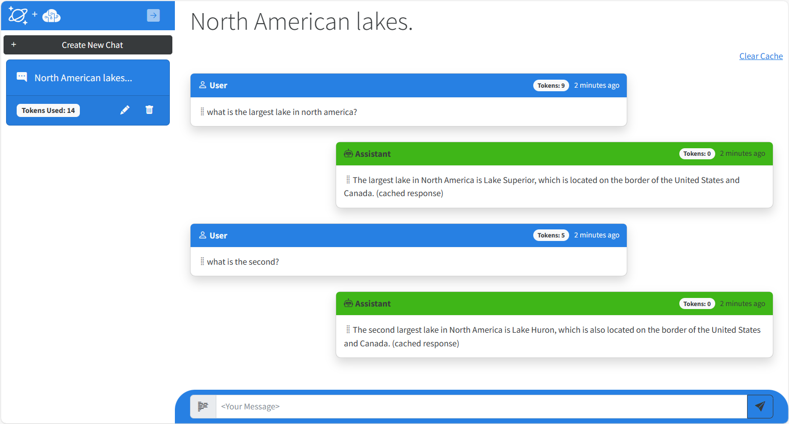

# Azure Cosmos DB + Azure OpenAI Service ChatGPT

This sample application combines Azure Cosmos DB with Azure OpenAI Service to build a simple AI-enabled Chat Application. The application is written in C# on .NET 8 with a Blazor Server front-end and is hosted on Azure Web Apps.

## Features

Individual chat sessions (or conversations) are displayed and can be selected in the left-hand nav. Clicking on a session will show the messages that contain user prompts and OpenAI completions. 

When a new prompt is sent to the Azure OpenAI Service, some or all of the conversation history is sent with it. This provides context allowing ChatGPT to respond as though it is having a conversation. The length of this conversation history can be configured from appsettings.json with the `OpenAiMaxTokens` value. When a user prompt is entered, the application will cycle from the most recent to the oldest prompts and completions, counting the tokens used for each. When it gets to the `OpenAiMaxTokens` it stops and returns the conversational history as far back as the token limit allows.

The "gpt-35-turbo" model used by this sample has a maximum of 4096 tokens. Token are used in both the request and reponse from the service. Overriding the maxConversationLength to values approaching maximum token value could result in completions that contain little to no text if all of it has been used in the request.

The history for all prompts and completions is stored in Azure Cosmos DB. Deleting a chat session in the UI will delete it's corresponding user prompts and completions.

The application summarizes the name of the chat session by asking ChatGPT to provide a one or two word summary of the first user prompt and completion. This allows you to easily identity different chat sessions.

Please note this is a sample application. It is intended to demonstrate how to use Azure Cosmos DB and Azure OpenAI Service ChatGPT together. It demonstrates how system prompts are used to define behavior for generation completions in a Generative AI scenario. It also provides an example of how to model data for a chat-based application.

## Getting Started

### Prerequisites

- Azure Subscription
- Subscription access to Azure OpenAI service. Start here to [Request Acces to Azure OpenAI Service](https://customervoice.microsoft.com/Pages/ResponsePage.aspx?id=v4j5cvGGr0GRqy180BHbR7en2Ais5pxKtso_Pz4b1_xUOFA5Qk1UWDRBMjg0WFhPMkIzTzhKQ1dWNyQlQCN0PWcu)
- Visual Studio, VS Code, or some editor if you want to edit or view the source for this sample.

### Installation from this repository

If you do not expect to modify this solution and deploy merged changes, you can install using this step below.

1. Click ***Deploy to Azure*** below and follow the prompts in Azure Portal to deploy this solution.

### Installation from forked repository

1. Click Fork in the upper right hand corner of this page to your account.
1. From your forked version, open this `README.md`` file to change the path for the ***Deploy To Azure*** button to your local repository. Commit the change to your repo.
1. Click ***Deploy to Azure*** below and follow the prompts in Azure Portal to deploy this solution.
1. In the Custom Deployment blade in Azure Portal, modify **App Git Repository** to point to your forked GitHub repo for this solution. By default the value is `https://github.com/Azure-Samples/cosmosdb-chatgpt.git`
1. If you deploy this solution without making either of these changes, you can update the repository by disconnecting and connecting an external git repository pointing to your fork from within Azure App Service Deployment Center blade in Azure Portal.

The provided ARM or Bicep Template will provision the following resources:

1. **Azure Cosmos DB** account with database and container at 400 RU/s. This can optionally be configured to run on the Cosmos DB free tier if available for your subscription.
1. **Azure App service** configured for CI/CD to your forked GitHub repository. This service can also be configured to run on App Service free tier.
1. **Azure OpenAI** You must also specify a name for the deployment of the "gpt-35-turbo" model which is used by this application.

**Note:** You must have access to Azure Open AI service from your subscription before attempting to deploy this application.

All connection information for Azure Cosmos DB and Azure Open AI is zero-touch and injected as environment variables in the Azure App Service instance at deployment time. 

**Note:** If you already have an Azure OpenAI account deployed and wish to use it with this application, use this template instead. You will be prompted to provide the name of the Azure OpenAI account, a key, and the name of the GPT 3.5 Turbo model used for completions.

### Quickstart

1. After deployment, go to the resource group for your deployment and open the Azure App Service in the Azure Portal. Click the web url to launch the website.
1. Click + New Chat to create a new chat session.
1. Type your question in the text box and press Enter.
1. Create new sessions and ask more questions on different topics.
1. View the token usage for the prompts and completions and the total for the session.

## Clean up

To remove all the resources used by this sample, you must first manually delete the deployed model within the Azure AI service (if you originally provisioned it using this sample). You can then delete the resource group for your deployment. This will delete all remaining resources.

## Resources

- [Azure Cosmos DB + Azure OpenAI ChatGPT Blog Post Announcement](https://devblogs.microsoft.com/cosmosdb/chatgpt-azure-cosmos-db/)
- [Azure Cosmos DB Free Trial](https://aka.ms/TryCosmos)
- [Azure OpenAI Service documentation](https://learn.microsoft.com/azure/cognitive-services/openai/)
- [Azure App Service documentation](https://learn.microsoft.com/azure/app-service/)
- [ASP.NET Core Blazor documentation](https://dotnet.microsoft.com/apps/aspnet/web-apps/blazor)
